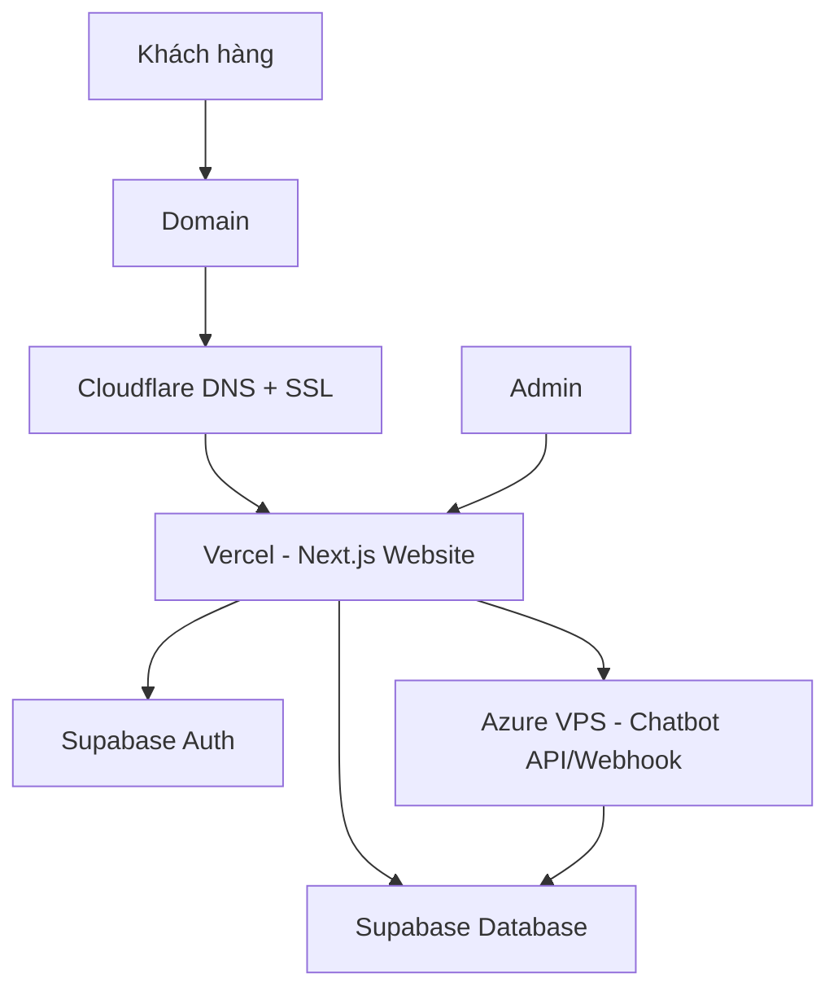
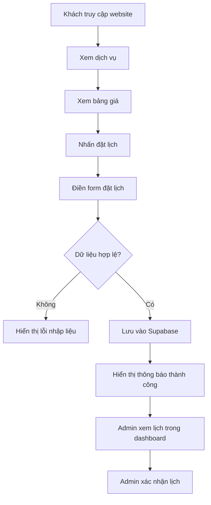
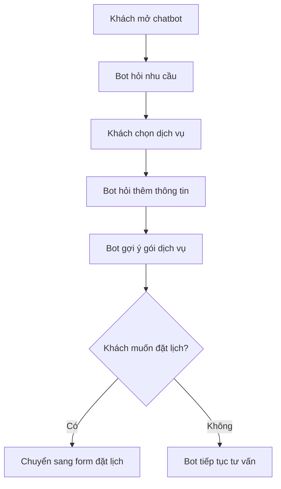
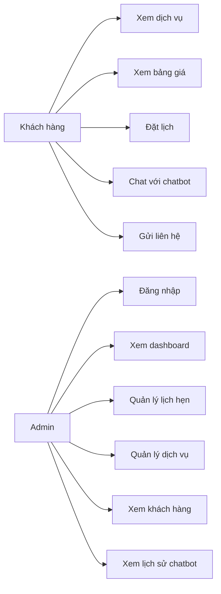
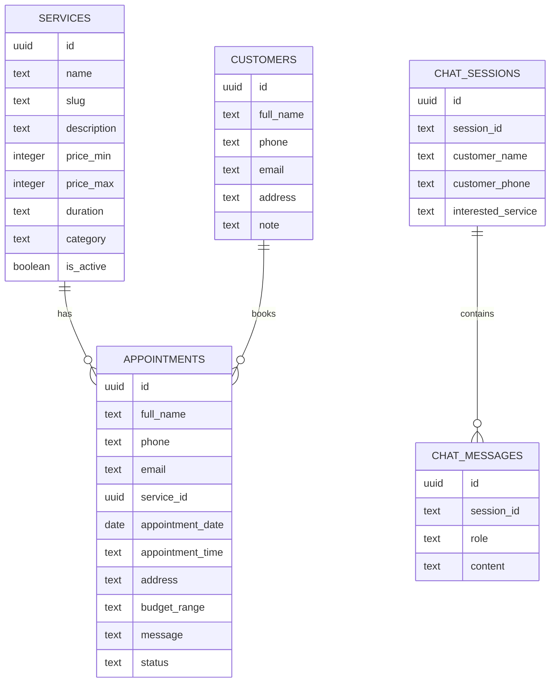

# MASTER PLAN - WEBSITE DỊCH VỤ IT ĐẶT LỊCH TÍCH HỢP CHATBOT

## 1. Tên đề tài

**Xây dựng website đặt lịch dịch vụ IT tích hợp chatbot tư vấn khách hàng**

Tên thương hiệu gợi ý:

- **TechCare IT Services**
- **Kiet IT Services**
- **IT Booking Care**
- **Home IT Support**

---

## 2. Mô tả tổng quan dự án

Website cung cấp các dịch vụ IT cho cá nhân, hộ gia đình, cửa hàng và doanh nghiệp nhỏ. Khách hàng có thể xem thông tin dịch vụ, tham khảo bảng giá, chat với chatbot để được tư vấn nhanh và đặt lịch kỹ thuật viên hỗ trợ.

Các dịch vụ chính gồm:

- Cài đặt Windows, driver, Office và phần mềm cơ bản.
- Sửa lỗi máy tính, laptop, mạng, máy in.
- Lắp đặt và cấu hình camera.
- Cấu hình Wi-Fi, router, switch, mạng nội bộ.
- Làm website giới thiệu, landing page, website doanh nghiệp.
- Tư vấn domain, Cloudflare, hosting, VPS, bảo mật cơ bản.
- Bảo trì IT định kỳ cho cửa hàng hoặc doanh nghiệp nhỏ.

---

## 3. Mục tiêu dự án

### 3.1. Mục tiêu chính

Xây dựng một website hoàn chỉnh cho phép khách hàng:

- Tìm hiểu dịch vụ IT.
- Xem bảng giá tham khảo.
- Đặt lịch hỗ trợ.
- Chat với chatbot để được tư vấn dịch vụ phù hợp.
- Nhận thông tin xác nhận sau khi gửi lịch hẹn.

Admin có thể:

- Quản lý lịch hẹn.
- Quản lý khách hàng.
- Quản lý danh sách dịch vụ.
- Xem tin nhắn chatbot.
- Xem thống kê cơ bản.

### 3.2. Mục tiêu kỹ thuật

Dự án sử dụng các công nghệ:

- **Next.js**: xây dựng website.
- **Tailwind CSS**: thiết kế giao diện.
- **Vercel**: deploy frontend.
- **Supabase**: database, authentication, lưu lịch hẹn.
- **Azure VPS**: chạy chatbot API, webhook hoặc cron job.
- **Cloudflare**: quản lý DNS, SSL, bảo mật domain.
- **Domain riêng**: trỏ về Vercel.

---

## 4. Đối tượng sử dụng

### 4.1. Khách hàng

Khách hàng là người cần hỗ trợ dịch vụ IT, ví dụ:

- Sinh viên cần cài Windows, Office, phần mềm học tập.
- Người dùng cá nhân cần sửa laptop, lỗi mạng, máy in.
- Hộ gia đình cần lắp camera, cấu hình Wi-Fi.
- Cửa hàng nhỏ cần setup camera, mạng, máy tính bán hàng.
- Doanh nghiệp nhỏ cần bảo trì IT định kỳ.
- Cá nhân/doanh nghiệp cần làm website.

### 4.2. Admin

Admin là người quản lý hệ thống, có quyền:

- Đăng nhập dashboard.
- Xem lịch hẹn.
- Cập nhật trạng thái lịch hẹn.
- Quản lý dịch vụ và giá.
- Xem thông tin khách hàng.
- Xem lịch sử chatbot.
- Theo dõi thống kê.

---

## 5. Phạm vi dự án

### 5.1. Phạm vi bản MVP

Bản MVP là phiên bản tối thiểu nhưng có thể demo hoàn chỉnh.

Chức năng gồm:

1. Trang chủ giới thiệu dịch vụ.
2. Trang danh sách dịch vụ.
3. Trang bảng giá.
4. Form đặt lịch.
5. Lưu lịch hẹn vào Supabase.
6. Dashboard admin xem lịch hẹn.
7. Cập nhật trạng thái lịch hẹn.
8. Chatbot tư vấn theo kịch bản.
9. Deploy website lên Vercel.
10. Trỏ domain qua Cloudflare.

### 5.2. Phạm vi nâng cao

Sau khi hoàn thành bản MVP, có thể phát triển thêm:

1. Chatbot AI kết nối API riêng.
2. Gửi email xác nhận lịch hẹn.
3. Gửi thông báo cho admin.
4. Lịch dạng calendar.
5. Xuất danh sách lịch hẹn ra Excel.
6. Upload ảnh dịch vụ.
7. Thanh toán online.
8. Tài khoản khách hàng.
9. Đánh giá dịch vụ sau khi hoàn thành.
10. Tính doanh thu dự kiến.

---

## 6. Yêu cầu chức năng

## 6.1. Nhóm chức năng cho khách hàng

### F01 - Xem trang chủ

Khách hàng có thể truy cập website và xem thông tin tổng quan:

- Tên thương hiệu.
- Mô tả dịch vụ.
- Các dịch vụ nổi bật.
- Lý do nên chọn dịch vụ.
- Bảng giá ngắn gọn.
- Nút đặt lịch.
- Nút chat tư vấn.

### F02 - Xem danh sách dịch vụ

Khách hàng có thể xem các nhóm dịch vụ:

- Cài Windows.
- Sửa máy tính.
- Lắp camera.
- Setup mạng.
- Làm website.
- Tư vấn VPS/domain/Cloudflare.
- Bảo trì IT.

Mỗi dịch vụ cần có:

- Tên dịch vụ.
- Mô tả.
- Giá thấp nhất.
- Giá cao nhất.
- Thời gian thực hiện dự kiến.
- Nút đặt lịch.

### F03 - Xem bảng giá

Khách hàng có thể xem bảng giá tham khảo.

Lưu ý hiển thị:

> Giá chỉ mang tính tham khảo. Chi phí thực tế có thể thay đổi tùy tình trạng thiết bị, khu vực hỗ trợ và yêu cầu cụ thể.

### F04 - Đặt lịch dịch vụ

Khách hàng nhập thông tin:

- Họ tên.
- Số điện thoại.
- Email.
- Dịch vụ cần hỗ trợ.
- Ngày hẹn.
- Giờ hẹn.
- Địa chỉ.
- Ngân sách dự kiến.
- Mô tả vấn đề.

Sau khi gửi:

- Hệ thống kiểm tra dữ liệu.
- Lưu lịch hẹn vào Supabase.
- Hiển thị thông báo đặt lịch thành công.
- Trạng thái mặc định là `pending`.

### F05 - Chatbot tư vấn

Chatbot hỗ trợ khách hàng:

- Hỏi nhu cầu.
- Gợi ý dịch vụ phù hợp.
- Gợi ý mức giá tham khảo.
- Hỏi thời gian khách muốn hỗ trợ.
- Gợi ý khách đặt lịch.

Ví dụ kịch bản:

1. Khách chọn "Cài Windows".
2. Bot hỏi: "Bạn muốn cài Windows 10 hay Windows 11?"
3. Bot hỏi: "Bạn có cần cài Office và phần mềm học tập không?"
4. Bot gợi ý: "Gói phù hợp là Cài Windows + Office + phần mềm cơ bản, giá khoảng 200.000đ - 300.000đ."
5. Bot hỏi: "Bạn có muốn đặt lịch không?"

### F06 - Gửi liên hệ nhanh

Khách hàng có thể gửi thông tin liên hệ:

- Họ tên.
- Số điện thoại.
- Nội dung cần tư vấn.

Admin nhận thông tin trong dashboard.

---

## 6.2. Nhóm chức năng cho admin

### F07 - Đăng nhập admin

Admin đăng nhập bằng tài khoản được tạo trong Supabase Auth.

Yêu cầu:

- Chỉ admin đăng nhập mới vào được dashboard.
- Người dùng thường không được truy cập dashboard.

### F08 - Xem dashboard tổng quan

Dashboard hiển thị:

- Tổng số lịch hẹn.
- Số lịch chờ xử lý.
- Số lịch đã xác nhận.
- Số lịch đã hoàn thành.
- Số lịch đã hủy.
- Dịch vụ được đặt nhiều nhất.
- Doanh thu dự kiến.

### F09 - Quản lý lịch hẹn

Admin có thể:

- Xem danh sách lịch hẹn.
- Tìm kiếm theo tên/số điện thoại.
- Lọc theo trạng thái.
- Xem chi tiết lịch hẹn.
- Cập nhật trạng thái:
  - `pending`: chờ xử lý.
  - `confirmed`: đã xác nhận.
  - `in_progress`: đang xử lý.
  - `completed`: hoàn thành.
  - `cancelled`: đã hủy.

### F10 - Quản lý dịch vụ

Admin có thể:

- Thêm dịch vụ.
- Sửa dịch vụ.
- Ẩn/hiện dịch vụ.
- Cập nhật giá.
- Cập nhật mô tả.

### F11 - Quản lý khách hàng

Admin có thể xem thông tin khách hàng:

- Họ tên.
- Số điện thoại.
- Email.
- Địa chỉ.
- Lịch sử đặt lịch.

### F12 - Xem lịch sử chatbot

Admin có thể xem:

- Nội dung khách đã hỏi.
- Thời gian nhắn.
- Dịch vụ khách quan tâm.
- Thông tin khách để lại nếu có.

---

## 7. Yêu cầu phi chức năng

### 7.1. Hiệu năng

- Website tải nhanh.
- Trang chủ tối ưu hình ảnh.
- Dữ liệu dashboard tải hợp lý.
- Form đặt lịch phản hồi nhanh.

### 7.2. Bảo mật

- Sử dụng Supabase Auth cho admin.
- Không public Supabase service role key ở frontend.
- Dùng Row Level Security nếu cần.
- Sử dụng HTTPS thông qua Vercel/Cloudflare.
- Validate dữ liệu form.

### 7.3. Giao diện

- Giao diện dễ dùng.
- Responsive trên điện thoại.
- Màu sắc theo phong cách công nghệ.
- Có CTA rõ ràng: "Đặt lịch ngay", "Chat tư vấn".

### 7.4. Khả năng mở rộng

- Có thể thêm dịch vụ mới.
- Có thể thêm chatbot AI.
- Có thể thêm email automation.
- Có thể thêm thanh toán online.

---

## 8. Kiến trúc hệ thống



### 8.1. Vai trò từng thành phần

| Thành phần | Vai trò |
|---|---|
| Domain | Tên miền chính của website |
| Cloudflare | Quản lý DNS, SSL, bảo mật cơ bản |
| Vercel | Deploy website Next.js |
| Supabase | Database, Auth, lưu lịch hẹn |
| Azure VPS | Chạy chatbot API, webhook, cron job |
| Next.js | Xây dựng frontend và API routes |
| Tailwind CSS | Thiết kế giao diện |

---

## 9. Sơ đồ luồng đặt lịch



---

## 10. Sơ đồ luồng chatbot



---

## 11. Use case tổng quát



---

## 12. User stories

### 12.1. Khách hàng

| Mã | User story |
|---|---|
| US01 | Là khách hàng, tôi muốn xem các dịch vụ IT để biết website hỗ trợ những gì. |
| US02 | Là khách hàng, tôi muốn xem bảng giá để ước lượng chi phí. |
| US03 | Là khách hàng, tôi muốn đặt lịch để kỹ thuật viên liên hệ hỗ trợ. |
| US04 | Là khách hàng, tôi muốn chat với chatbot để được tư vấn nhanh. |
| US05 | Là khách hàng, tôi muốn gửi mô tả lỗi để admin hiểu vấn đề trước khi liên hệ. |

### 12.2. Admin

| Mã | User story |
|---|---|
| US06 | Là admin, tôi muốn đăng nhập để quản lý hệ thống. |
| US07 | Là admin, tôi muốn xem danh sách lịch hẹn để xử lý khách hàng. |
| US08 | Là admin, tôi muốn cập nhật trạng thái lịch hẹn để theo dõi tiến độ. |
| US09 | Là admin, tôi muốn quản lý dịch vụ để cập nhật giá và mô tả. |
| US10 | Là admin, tôi muốn xem thống kê để biết dịch vụ nào được quan tâm nhiều. |

---

## 13. Thiết kế database Supabase

## 13.1. Bảng `services`

Lưu danh sách dịch vụ.

```sql
create table services (
  id uuid primary key default gen_random_uuid(),
  name text not null,
  slug text unique not null,
  description text,
  price_min integer,
  price_max integer,
  duration text,
  category text,
  icon text,
  is_active boolean default true,
  created_at timestamp with time zone default now()
);
```

### Dữ liệu mẫu

```sql
insert into services (name, slug, description, price_min, price_max, duration, category, icon)
values
('Cài Windows & phần mềm', 'cai-windows', 'Cài Windows 10/11, driver, Office và phần mềm cơ bản.', 150000, 300000, '1 - 2 giờ', 'computer', 'monitor'),
('Sửa lỗi máy tính', 'sua-may-tinh', 'Kiểm tra lỗi máy chậm, lỗi phần mềm, lỗi mạng, lỗi máy in.', 100000, 500000, '1 - 3 giờ', 'computer', 'wrench'),
('Lắp đặt camera', 'lap-camera', 'Tư vấn, lắp đặt và cấu hình camera xem qua điện thoại.', 900000, 5900000, '1 buổi', 'camera', 'camera'),
('Setup Wi-Fi & mạng', 'setup-mang', 'Cấu hình router, Wi-Fi, switch, máy in mạng và camera mạng.', 150000, 800000, '1 - 3 giờ', 'network', 'wifi'),
('Thiết kế website', 'thiet-ke-website', 'Thiết kế landing page, website giới thiệu, website doanh nghiệp.', 2200000, 10000000, '3 - 14 ngày', 'website', 'globe'),
('Tư vấn VPS, Domain, Cloudflare', 'tu-van-vps-domain', 'Tư vấn deploy web, cấu hình domain, Cloudflare, SSL, VPS.', 200000, 1000000, '1 - 2 giờ', 'cloud', 'cloud');
```

---

## 13.2. Bảng `appointments`

Lưu lịch hẹn của khách.

```sql
create table appointments (
  id uuid primary key default gen_random_uuid(),
  full_name text not null,
  phone text not null,
  email text,
  service_id uuid references services(id),
  appointment_date date not null,
  appointment_time text not null,
  address text,
  budget_range text,
  message text,
  status text default 'pending',
  estimated_price integer,
  created_at timestamp with time zone default now(),
  updated_at timestamp with time zone default now()
);
```

### Trạng thái lịch hẹn

| Status | Ý nghĩa |
|---|---|
| pending | Chờ xử lý |
| confirmed | Đã xác nhận |
| in_progress | Đang xử lý |
| completed | Hoàn thành |
| cancelled | Đã hủy |

---

## 13.3. Bảng `customers`

Lưu thông tin khách hàng.

```sql
create table customers (
  id uuid primary key default gen_random_uuid(),
  full_name text not null,
  phone text not null,
  email text,
  address text,
  note text,
  created_at timestamp with time zone default now()
);
```

---

## 13.4. Bảng `chat_sessions`

Lưu phiên chat.

```sql
create table chat_sessions (
  id uuid primary key default gen_random_uuid(),
  session_id text unique not null,
  customer_name text,
  customer_phone text,
  interested_service text,
  created_at timestamp with time zone default now()
);
```

---

## 13.5. Bảng `chat_messages`

Lưu tin nhắn chatbot.

```sql
create table chat_messages (
  id uuid primary key default gen_random_uuid(),
  session_id text not null,
  role text not null,
  content text not null,
  created_at timestamp with time zone default now()
);
```

Role gồm:

- `user`
- `assistant`
- `system`

---

## 13.6. Sơ đồ ERD



---

## 14. Thiết kế giao diện

## 14.1. Màu sắc

| Thành phần | Màu gợi ý |
|---|---|
| Nền chính | Trắng / xám nhạt |
| Màu chính | Xanh dương |
| Màu phụ | Xanh lá |
| Cảnh báo | Cam |
| Lỗi | Đỏ |
| Text chính | Đen / xám đậm |

## 14.2. Layout trang chủ

Các phần chính:

1. Header.
2. Hero section.
3. Dịch vụ nổi bật.
4. Quy trình làm việc.
5. Bảng giá.
6. Vì sao chọn chúng tôi.
7. Form đặt lịch nhanh.
8. Chatbot floating button.
9. Footer.

## 14.3. Header

Menu gồm:

- Trang chủ.
- Dịch vụ.
- Bảng giá.
- Đặt lịch.
- Liên hệ.
- Admin.

## 14.4. Hero section

Nội dung gợi ý:

**Dịch vụ IT tận nơi cho cá nhân và doanh nghiệp nhỏ**

Hỗ trợ cài Windows, sửa máy tính, lắp camera, setup Wi-Fi, làm website, tư vấn VPS, domain và Cloudflare.

Nút:

- **Đặt lịch ngay**
- **Chat tư vấn**

## 14.5. Card dịch vụ

Mỗi card gồm:

- Icon.
- Tên dịch vụ.
- Mô tả ngắn.
- Giá từ.
- Nút xem chi tiết.
- Nút đặt lịch.

---

## 15. Bảng giá tham khảo

| Dịch vụ | Giá tham khảo |
|---|---:|
| Cài Windows + Driver | 150.000đ - 250.000đ |
| Cài Windows + Office + phần mềm cơ bản | 200.000đ - 300.000đ |
| Cài Windows + phần mềm chuyên dụng | 300.000đ - 500.000đ |
| Sửa lỗi máy tính cơ bản | 100.000đ - 300.000đ |
| Vệ sinh laptop | 250.000đ - 400.000đ |
| Cài Win + vệ sinh laptop | 350.000đ - 600.000đ |
| Lắp camera Wi-Fi độc lập | 900.000đ - 1.800.000đ/camera |
| Lắp camera IP trọn bộ 1 mắt | 1.800.000đ - 2.800.000đ/camera |
| Gói 4 camera cơ bản | 3.200.000đ - 5.900.000đ |
| Setup Wi-Fi/router | 150.000đ - 500.000đ |
| Setup mạng nội bộ nhỏ | 500.000đ - 2.000.000đ |
| Website giới thiệu cơ bản | 2.200.000đ - 5.000.000đ |
| Website doanh nghiệp/bán hàng | 5.000.000đ - 10.000.000đ+ |
| Tư vấn VPS/domain/Cloudflare | 200.000đ - 1.000.000đ |
| Bảo trì IT định kỳ | Báo giá theo số lượng thiết bị |

---

## 16. Cấu trúc thư mục dự án Next.js

```text
techcare-it-services/
├── app/
│   ├── page.tsx
│   ├── services/
│   │   └── page.tsx
│   ├── pricing/
│   │   └── page.tsx
│   ├── booking/
│   │   └── page.tsx
│   ├── admin/
│   │   ├── page.tsx
│   │   ├── appointments/
│   │   │   └── page.tsx
│   │   ├── services/
│   │   │   └── page.tsx
│   │   └── chats/
│   │       └── page.tsx
│   ├── api/
│   │   ├── appointments/
│   │   │   └── route.ts
│   │   └── chatbot/
│   │       └── route.ts
│   └── layout.tsx
│
├── components/
│   ├── Header.tsx
│   ├── Footer.tsx
│   ├── Hero.tsx
│   ├── ServiceCard.tsx
│   ├── PricingTable.tsx
│   ├── BookingForm.tsx
│   ├── ChatbotWidget.tsx
│   └── AdminSidebar.tsx
│
├── lib/
│   ├── supabase.ts
│   ├── services.ts
│   ├── appointments.ts
│   └── chatbot.ts
│
├── public/
│   ├── images/
│   └── logo.png
│
├── .env.local
├── package.json
├── tailwind.config.ts
└── README.md
```

---

## 17. Các route chính

| Route | Chức năng |
|---|---|
| `/` | Trang chủ |
| `/services` | Danh sách dịch vụ |
| `/pricing` | Bảng giá |
| `/booking` | Đặt lịch |
| `/admin` | Dashboard admin |
| `/admin/appointments` | Quản lý lịch hẹn |
| `/admin/services` | Quản lý dịch vụ |
| `/admin/chats` | Xem lịch sử chatbot |
| `/api/appointments` | API tạo lịch hẹn |
| `/api/chatbot` | API chatbot |

---

## 18. Quy trình phát triển từng bước

## Bước 1 - Khởi tạo dự án

Tạo project Next.js:

```bash
npx create-next-app@latest techcare-it-services
cd techcare-it-services
```

Gợi ý chọn:

```text
TypeScript: Yes
ESLint: Yes
Tailwind CSS: Yes
App Router: Yes
src directory: No
Import alias: Yes
```

Chạy thử:

```bash
npm run dev
```

---

## Bước 2 - Cài thư viện cần thiết

```bash
npm install @supabase/supabase-js lucide-react
```

Nếu cần form nâng cao:

```bash
npm install react-hook-form zod
```

---

## Bước 3 - Tạo project Supabase

Thực hiện:

1. Vào Supabase.
2. Tạo project mới.
3. Lưu lại:
   - Project URL.
   - Anon public key.
4. Tạo các bảng:
   - `services`
   - `appointments`
   - `customers`
   - `chat_sessions`
   - `chat_messages`

---

## Bước 4 - Tạo file `.env.local`

```env
NEXT_PUBLIC_SUPABASE_URL=your_supabase_project_url
NEXT_PUBLIC_SUPABASE_ANON_KEY=your_supabase_anon_key
```

Lưu ý:

- Không đưa `.env.local` lên GitHub.
- Không dùng service role key ở frontend.

---

## Bước 5 - Tạo Supabase client

File: `lib/supabase.ts`

```ts
import { createClient } from '@supabase/supabase-js'

const supabaseUrl = process.env.NEXT_PUBLIC_SUPABASE_URL!
const supabaseAnonKey = process.env.NEXT_PUBLIC_SUPABASE_ANON_KEY!

export const supabase = createClient(supabaseUrl, supabaseAnonKey)
```

---

## Bước 6 - Làm giao diện trang chủ

Các component cần làm:

- `Header.tsx`
- `Hero.tsx`
- `ServiceCard.tsx`
- `PricingTable.tsx`
- `BookingForm.tsx`
- `Footer.tsx`

Trang chủ cần có:

- Banner giới thiệu.
- Dịch vụ nổi bật.
- Bảng giá ngắn.
- Quy trình 4 bước.
- Form đặt lịch nhanh.
- Chatbot button.

---

## Bước 7 - Làm form đặt lịch

Form cần validate:

- Họ tên không được bỏ trống.
- Số điện thoại không được bỏ trống.
- Dịch vụ không được bỏ trống.
- Ngày hẹn không được bỏ trống.
- Giờ hẹn không được bỏ trống.

Khi submit:

1. Lấy dữ liệu form.
2. Gửi vào bảng `appointments`.
3. Nếu thành công, hiện thông báo.
4. Reset form.

---

## Bước 8 - Làm dashboard admin

Dashboard cần hiển thị:

- Tổng lịch hẹn.
- Lịch chờ xử lý.
- Lịch đã xác nhận.
- Lịch hoàn thành.
- Danh sách lịch mới nhất.

Trang quản lý lịch hẹn:

- Bảng danh sách.
- Cột họ tên.
- Số điện thoại.
- Dịch vụ.
- Ngày hẹn.
- Giờ hẹn.
- Trạng thái.
- Nút cập nhật.

---

## Bước 9 - Làm chatbot rule-based

Bản đầu có thể làm chatbot đơn giản theo kịch bản.

Kịch bản chính:

1. Bot chào khách.
2. Bot hỏi khách cần dịch vụ nào.
3. Khách chọn dịch vụ.
4. Bot gợi ý giá.
5. Bot hỏi khách có muốn đặt lịch không.
6. Nếu có, chuyển đến form đặt lịch.

Ví dụ dữ liệu chatbot:

```ts
const botReplies = {
  windows: 'Gói cài Windows có giá khoảng 150.000đ - 300.000đ. Bạn có cần cài Office và phần mềm cơ bản không?',
  camera: 'Dịch vụ lắp camera có giá tùy số lượng mắt camera. Gói cơ bản từ khoảng 900.000đ/camera.',
  network: 'Setup Wi-Fi/router có giá khoảng 150.000đ - 500.000đ tùy yêu cầu.',
  website: 'Website giới thiệu cơ bản từ khoảng 2.200.000đ - 5.000.000đ.',
}
```

---

## Bước 10 - Deploy lên Vercel

Thực hiện:

1. Đưa code lên GitHub.
2. Vào Vercel.
3. Import repository.
4. Thêm biến môi trường:
   - `NEXT_PUBLIC_SUPABASE_URL`
   - `NEXT_PUBLIC_SUPABASE_ANON_KEY`
5. Deploy.

---

## Bước 11 - Cấu hình domain và Cloudflare

Quy trình:

1. Mua domain.
2. Thêm domain vào Cloudflare.
3. Đổi nameserver của domain sang Cloudflare.
4. Trong Cloudflare, tạo DNS record:
   - CNAME `www` trỏ về Vercel.
   - A hoặc CNAME domain chính theo hướng dẫn Vercel.
5. Vào Vercel thêm custom domain.
6. Kiểm tra SSL.
7. Bật HTTPS.

---

## Bước 12 - Azure VPS

Azure VPS có thể dùng cho:

- Chatbot API nâng cao.
- Webhook gửi thông báo.
- Cron job kiểm tra lịch hẹn.
- API riêng nếu không muốn dùng Next.js API route.

Cấu hình cơ bản:

1. Tạo Azure VM Ubuntu.
2. SSH vào VPS.
3. Cài Node.js.
4. Clone backend chatbot.
5. Cài PM2.
6. Chạy API.
7. Cấu hình NGINX reverse proxy.
8. Trỏ subdomain qua Cloudflare, ví dụ `api.domain.com`.

---

## 19. API cần có

## 19.1. API tạo lịch hẹn

Endpoint:

```text
POST /api/appointments
```

Body:

```json
{
  "full_name": "Nguyễn Văn A",
  "phone": "0909123456",
  "email": "a@gmail.com",
  "service_id": "uuid",
  "appointment_date": "2026-06-01",
  "appointment_time": "09:00",
  "address": "Quận 1, TP.HCM",
  "budget_range": "300.000đ - 500.000đ",
  "message": "Máy tính bị chậm, muốn cài lại Windows."
}
```

Response thành công:

```json
{
  "success": true,
  "message": "Đặt lịch thành công"
}
```

---

## 19.2. API chatbot

Endpoint:

```text
POST /api/chatbot
```

Body:

```json
{
  "session_id": "abc123",
  "message": "Tôi muốn cài Windows"
}
```

Response:

```json
{
  "reply": "Dịch vụ cài Windows có giá khoảng 150.000đ - 300.000đ. Bạn muốn cài Windows 10 hay Windows 11?"
}
```

---

## 20. Checklist hoàn thành MVP

### Giao diện

- [ ] Có trang chủ.
- [ ] Có header.
- [ ] Có footer.
- [ ] Có section dịch vụ.
- [ ] Có section bảng giá.
- [ ] Có form đặt lịch.
- [ ] Có chatbot button.
- [ ] Responsive trên điện thoại.

### Database

- [ ] Tạo bảng `services`.
- [ ] Tạo bảng `appointments`.
- [ ] Tạo bảng `customers`.
- [ ] Tạo bảng `chat_sessions`.
- [ ] Tạo bảng `chat_messages`.
- [ ] Thêm dữ liệu mẫu cho services.

### Chức năng khách hàng

- [ ] Xem dịch vụ.
- [ ] Xem giá.
- [ ] Gửi form đặt lịch.
- [ ] Nhận thông báo đặt lịch thành công.
- [ ] Chat với chatbot.

### Chức năng admin

- [ ] Đăng nhập admin.
- [ ] Xem dashboard.
- [ ] Xem danh sách lịch hẹn.
- [ ] Cập nhật trạng thái lịch hẹn.
- [ ] Xem lịch sử chatbot.

### Deploy

- [ ] Code đẩy lên GitHub.
- [ ] Deploy lên Vercel.
- [ ] Thêm biến môi trường trên Vercel.
- [ ] Cấu hình domain.
- [ ] Cấu hình Cloudflare.
- [ ] Kiểm tra HTTPS.
- [ ] Kiểm tra form trên production.

---

## 21. Tiêu chí nghiệm thu

Dự án được xem là hoàn thành bản đầu nếu:

1. Website truy cập được bằng domain thật.
2. Trang chủ hiển thị đầy đủ dịch vụ.
3. Khách hàng đặt lịch thành công.
4. Dữ liệu lịch hẹn lưu vào Supabase.
5. Admin xem được lịch hẹn trong dashboard.
6. Admin cập nhật được trạng thái lịch hẹn.
7. Chatbot trả lời được các câu hỏi cơ bản.
8. Website responsive trên điện thoại.
9. Website deploy thành công trên Vercel.
10. Domain được quản lý qua Cloudflare.

---

## 22. Nội dung báo cáo có thể viết

## 22.1. Lý do chọn đề tài

Hiện nay, nhu cầu sử dụng dịch vụ IT tại nhà và tại các doanh nghiệp nhỏ ngày càng phổ biến. Người dùng thường cần hỗ trợ cài đặt Windows, sửa lỗi máy tính, lắp đặt camera, cấu hình mạng, thiết lập website, VPS và domain. Tuy nhiên, việc liên hệ và đặt lịch còn thủ công, khó quản lý và dễ bỏ sót thông tin khách hàng.

Vì vậy, đề tài xây dựng website đặt lịch dịch vụ IT tích hợp chatbot tư vấn khách hàng được lựa chọn nhằm hỗ trợ khách hàng tiếp cận dịch vụ nhanh hơn, đồng thời giúp người quản trị dễ dàng quản lý lịch hẹn, khách hàng và dịch vụ.

## 22.2. Mục tiêu báo cáo

- Phân tích nhu cầu sử dụng dịch vụ IT.
- Xây dựng website giới thiệu dịch vụ.
- Xây dựng chức năng đặt lịch.
- Tích hợp chatbot tư vấn cơ bản.
- Xây dựng dashboard quản trị.
- Triển khai website lên môi trường thực tế bằng Vercel, Supabase, Azure VPS, domain và Cloudflare.

## 22.3. Kết quả mong đợi

- Website có giao diện thân thiện.
- Người dùng dễ dàng đặt lịch.
- Admin quản lý lịch hẹn hiệu quả.
- Chatbot hỗ trợ tư vấn cơ bản.
- Hệ thống có khả năng mở rộng trong tương lai.

---

## 23. Gợi ý ảnh cần chụp để nộp báo cáo

Khi làm xong, nên chụp các ảnh sau:

1. Giao diện trang chủ.
2. Danh sách dịch vụ.
3. Bảng giá.
4. Form đặt lịch.
5. Thông báo đặt lịch thành công.
6. Bảng dữ liệu `appointments` trong Supabase.
7. Dashboard admin.
8. Màn hình cập nhật trạng thái lịch hẹn.
9. Chatbot đang tư vấn.
10. Deploy thành công trên Vercel.
11. Cấu hình domain trong Vercel.
12. DNS trong Cloudflare.
13. Website chạy bằng domain thật.
14. Azure VPS đang chạy API hoặc terminal SSH.
15. GitHub repository.

---

## 24. Thứ tự code đề xuất

Nên làm theo thứ tự sau để tránh rối:

1. Làm giao diện tĩnh trước.
2. Tạo Supabase database.
3. Kết nối Supabase.
4. Làm form đặt lịch.
5. Làm dashboard xem lịch.
6. Làm cập nhật trạng thái.
7. Làm chatbot đơn giản.
8. Deploy Vercel.
9. Cấu hình domain Cloudflare.
10. Bổ sung Azure VPS.
11. Hoàn thiện giao diện.
12. Viết báo cáo.

---

## 25. Phiên bản phát triển

### Version 1.0 - MVP

- Trang chủ.
- Dịch vụ.
- Bảng giá.
- Đặt lịch.
- Supabase.
- Dashboard admin.
- Chatbot rule-based.
- Deploy Vercel.

### Version 1.1

- Gửi email xác nhận.
- Tìm kiếm/lọc lịch hẹn.
- Quản lý dịch vụ trong admin.
- Lưu khách hàng.

### Version 2.0

- Chatbot AI.
- Azure VPS API.
- Calendar view.
- Xuất Excel.
- Đánh giá dịch vụ.
- Thanh toán online.

---

## 26. Ghi chú quan trọng khi làm

- Không cần làm quá phức tạp ngay từ đầu.
- Làm được form đặt lịch lưu Supabase là phần quan trọng nhất.
- Dashboard admin chỉ cần rõ ràng, không cần quá nhiều hiệu ứng.
- Chatbot ban đầu có thể làm theo kịch bản, chưa cần AI thật.
- Azure VPS có thể để phần nâng cao hoặc demo API riêng.
- Vercel + Supabase + Cloudflare là đủ để web chạy thật.
- Khi báo cáo, nhấn mạnh đây là hệ thống có khả năng mở rộng.

---

## 27. Kết luận

Dự án website dịch vụ IT đặt lịch tích hợp chatbot là đề tài thực tế, phù hợp với định hướng IT Helpdesk, quản trị mạng, triển khai web và dịch vụ kỹ thuật. Hệ thống giúp khách hàng dễ dàng chọn dịch vụ, xem giá và đặt lịch, đồng thời giúp admin quản lý lịch hẹn và khách hàng hiệu quả.

Dự án cũng thể hiện được nhiều kỹ năng quan trọng như xây dựng website bằng Next.js, quản lý dữ liệu với Supabase, deploy bằng Vercel, cấu hình domain qua Cloudflare và triển khai dịch vụ phụ trên Azure VPS.
